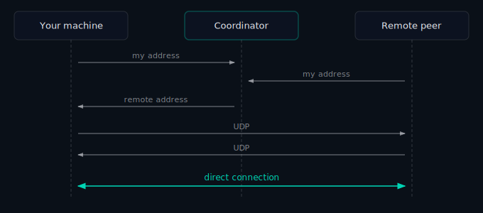
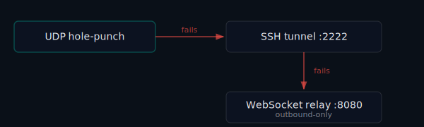

# NAT Traversal: The Dark Art of Making Peers Find Each Other

Your laptop doesn't have a real IP address. Neither does the server in your home lab. Neither does your friend's machine across town. They all live behind routers that hand out private addresses — `192.168.x.x`, `10.x.x.x` — that mean nothing on the public internet.

This is NAT, and it's the reason making two machines talk directly to each other is surprisingly hard.

## What NAT Does (and Why It's a Problem)

Think of your router as a receptionist. When you make an outbound call (open a connection), the receptionist logs it: "Machine A on the inside sent a packet to Server B on the outside." When the reply comes back, the receptionist knows to route it to Machine A.

The problem: if a stranger calls in from outside asking for Machine A — without Machine A having called first — the receptionist doesn't have a record of it and hangs up.

Now imagine both sides are behind their own receptionist. Neither can call the other directly. This is the problem TunnelMesh has to solve every time two peers try to connect.

## Four Flavours of NAT

Not all routers behave identically. They range from permissive to very strict:

| NAT type | What it allows | Hole-punching? |
|---|---|---|
| Full cone | Anyone can send once you've sent anywhere | ✓ |
| Restricted cone | Only hosts you've already sent to | ✓ |
| Port-restricted | Only the exact IP:port you've sent to | ✓ |
| Symmetric | Different external port per destination | ✗ |

Most home routers are restricted cone or port-restricted. Symmetric NAT shows up in corporate networks and some mobile carriers — and it's where simple hole-punching breaks down.

## The Hole-Punching Trick

For the first three NAT types, TunnelMesh uses a technique called **UDP hole-punching**:

The key is that both peers send at the same time. When your machine sends a UDP packet, your router records an outgoing mapping. When the remote peer's packet arrives a moment later, the router recognises it as a reply to your outgoing packet — and lets it through.

Timing matters. The coordinator signals both peers simultaneously so neither side fires too early or too late.

## When It Doesn't Work

Symmetric NAT breaks this. When your machine sends a packet to the coordinator, your router assigns it one external port. When it sends to the remote peer, it assigns a *different* external port. The address you told the coordinator is already wrong by the time the remote peer tries to use it.

For these situations — and for strict corporate firewalls that block unsolicited UDP entirely — TunnelMesh has fallbacks.

## The Fallback Chain

The **SSH tunnel** routes traffic through the coordinator over TCP. Most firewalls allow outbound TCP on port 2222.

The **WebSocket relay** is the last resort — both peers connect outbound to the coordinator, which stitches them together. Outbound HTTP/HTTPS connections work through almost anything, including corporate proxies.

TunnelMesh doesn't give up on better paths once it's fallen back. If a direct UDP connection becomes possible later — because you moved to a different network, or a firewall rule changed — it will be promoted automatically.

---

*TunnelMesh is released under the [AGPL-3.0 License](https://github.com/tunnelmesh/tunnelmesh/blob/main/LICENSE).*
