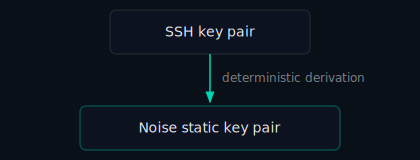

# The Noise Protocol: How TunnelMesh Handles Encryption

Before two TunnelMesh nodes can exchange a single encrypted packet, they need to shake hands. Not the social kind — a cryptographic handshake where both sides prove who they are and agree on secret keys that nobody else will ever know.

TunnelMesh uses the [Noise Protocol Framework](https://noiseprotocol.org/) for this. Here's what that actually means.

## Why Not Just Use TLS?

TLS is what your browser uses to talk to websites. It works great for that. For a mesh VPN, it brings a lot of baggage:

- You need certificates — a Certificate Authority to issue them, a process to renew them, somewhere to store them
- TLS negotiates cipher suites and protocol versions, which means more code and more things that can go wrong
- TLS was designed for client-server connections, not peer-to-peer

Noise is a framework for building exactly the handshake you need and nothing else. You pick a pattern from a catalogue, name your algorithms, and the spec tells you exactly what bytes go over the wire and exactly what security properties you get. No surprises.

## The Pattern: IKpsk2

TunnelMesh uses the `IKpsk2` pattern. The name is a recipe:

```
I   = the initiator sends their static key in message 1 (encrypted)
K   = the responder's static key is already known to the initiator
psk2 = a pre-shared key is mixed into message 2
```

After two messages — one from each side — both peers have:

1. **Verified each other's identity** via their long-term keys
2. **Agreed on fresh session keys** using ephemeral (one-time) key pairs
3. **Bound themselves to the same network** via the pre-shared key

That third property is important. Even if an attacker has a valid TunnelMesh keypair from a different network, the PSK check will reject them. You can't join a mesh you weren't given a token for.

## Where the Keys Come From

Every machine in a TunnelMesh network has a *static key* — its long-term identity. Rather than generating a separate set of keys, TunnelMesh derives this from the machine's SSH key:



`tunnelmesh init` handles this. If you'd rather reuse an existing SSH key, point the config at it.

The coordinator stores everyone's public keys. Private keys never leave the machine.

## What Happens After the Handshake

Once the handshake completes, both sides have symmetric session keys. All traffic from that point on is encrypted with **ChaCha20-Poly1305** — a modern cipher that authenticates every packet, so a modified or replayed packet is detected and dropped immediately.

The session keys are derived from the handshake transcript, not from the long-term keys directly. This means:

> **If your long-term key is ever compromised, past sessions are still safe.** The session keys are gone and can't be reconstructed.

This property — called *forward secrecy* — is one of the main reasons to use Noise over simpler approaches.

## The Coordinator's Role

The coordinator helps peers find each other's public keys and facilitates relay when direct connections fail. It's **not** in the encryption loop. The coordinator never sees session keys and cannot decrypt any traffic between peers.

---

*TunnelMesh is released under the [AGPL-3.0 License](https://github.com/tunnelmesh/tunnelmesh/blob/main/LICENSE).*
