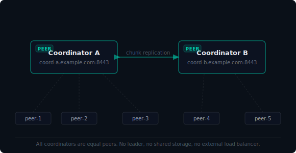

# Coordinator High Availability

> [!WARNING]
> This describes a **manual workaround**, not a built-in HA mode. Native multi-coordinator federation is on the roadmap. This guide documents what works today.

## The Problem

A single coordinator is a single point of failure. If the coordinator node goes down:

- Peers already connected to each other continue to route traffic normally (the mesh is peer-to-peer once established)
- New peers cannot join until the coordinator recovers
- Peers that lose their connection cannot re-establish it
- The admin dashboard becomes inaccessible

For meshes where continuous peer join availability matters, this is a problem.

## The Workaround

You can run two coordinator instances behind an external load balancer with shared persistent storage. This gives you coordinator redundancy without waiting for built-in federation support.

```
          ┌─────────────────────┐
          │   Load Balancer     │
          │  (HAProxy / nginx / │
          │   cloud LB)         │
          └──────────┬──────────┘
                     │
          ┌──────────┴──────────┐
          │                     │
   ┌──────┴──────┐       ┌──────┴──────┐
   │ Coordinator │       │ Coordinator │
   │     A       │       │     B       │
   └──────┬──────┘       └──────┬──────┘
          │                     │
          └──────────┬──────────┘
                     │
          ┌──────────┴──────────┐
          │   Shared Storage    │
          │  (NFS / EFS / GFS2) │
          └─────────────────────┘
```



### What "Shared State" Means

Both coordinators must point to the same `data_dir`. This directory holds:

- The peer registry and SSH public key store
- S3 object data and metadata
- Packet filter rules and DNS records

The simplest shared storage options are:

- **NFS mount** — works anywhere, low operational overhead for small meshes
- **AWS EFS / DigitalOcean Volumes** — managed NFS for cloud deployments
- **GlusterFS or Ceph** — if you need higher throughput

> [!CAUTION]
> Both coordinators writing to the same filesystem simultaneously can cause corruption if the filesystem doesn't provide proper locking. Use NFS with `lockd`, or a distributed filesystem designed for concurrent access. Do **not** use a raw S3 bucket or object storage as the shared filesystem — the coordinator expects a POSIX filesystem.

### Gossip Cluster

The two coordinators should form a gossip cluster using the `memberlist_seeds` config. This lets them share peer state in memory and reduces the load on the shared filesystem.

```yaml
# coordinator-a.yaml
name: "coordinator-a"

coordinator:
  enabled: true
  listen: ":8443"
  data_dir: "/mnt/shared/tunnelmesh"       # Shared NFS mount
  admin_peers:
    - "a1b2c3d4e5f6g7h8"
  memberlist_seeds:
    - "coordinator-b.example.com:7946"     # Coordinator B's gossip address
  memberlist_bind_addr: ":7946"
```

```yaml
# coordinator-b.yaml
name: "coordinator-b"

coordinator:
  enabled: true
  listen: ":8443"
  data_dir: "/mnt/shared/tunnelmesh"       # Same shared NFS mount
  admin_peers:
    - "a1b2c3d4e5f6g7h8"
  memberlist_seeds:
    - "coordinator-a.example.com:7946"     # Coordinator A's gossip address
  memberlist_bind_addr: ":7946"
```

### Load Balancer Configuration

Configure the load balancer to:

1. Health-check each coordinator on `GET /health`
2. Route new peer join requests to whichever coordinator is healthy
3. Use sticky sessions (session affinity by source IP) so a connected peer doesn't bounce between coordinators mid-session

Example HAProxy configuration:

```
frontend tunnelmesh
    bind *:8443
    default_backend coordinators

backend coordinators
    balance source              # Sticky by source IP
    option httpchk GET /health
    server coord-a coordinator-a.example.com:8443 check
    server coord-b coordinator-b.example.com:8443 check backup
```

> [!TIP]
> For cloud deployments, use the Terraform modules in [Cloud Deployment](CLOUD_DEPLOYMENT.md) to provision the load balancer and shared volume alongside your coordinator nodes.

### Peer Configuration

Peers should point to the load balancer's address, not directly to a coordinator:

```bash
# Join via the load balancer
tunnelmesh join lb.example.com:8443 --token your-token
```

If you configure DNS round-robin instead of a proper load balancer, be aware that peers will hold their connection to whichever coordinator they initially resolved — a coordinator failure will require peers to reconnect.

---

## Limitations

This is a workaround, not a first-class HA deployment. Be aware of:

- **Shared filesystem is a dependency** — if the NFS mount fails, both coordinators fail regardless of their own health
- **No automatic failover for active sessions** — if coordinator A fails while a peer is mid-handshake, that peer must retry (it will, automatically, after the heartbeat timeout)
- **Split-brain risk** — if coordinators cannot reach each other's gossip port but can both reach the filesystem, they may serve inconsistent peer lists
- **Manual setup required** — no tooling yet to automate the NFS mount, coordinator config, or load balancer provisioning end-to-end

For production use, treat the shared storage as the highest-priority component to monitor and protect.

---

## Related Documentation

- **[Cloud Deployment](CLOUD_DEPLOYMENT.md)** — Terraform modules for provisioning coordinators on cloud infrastructure
- **[Admin Guide](ADMIN.md)** — Coordinator configuration reference
- **[Docker Deployment](DOCKER.md)** — Multi-coordinator Docker Compose setup (useful for testing this configuration locally)

---

*TunnelMesh is released under the [AGPL-3.0 License](https://github.com/tunnelmesh/tunnelmesh/blob/main/LICENSE).*
